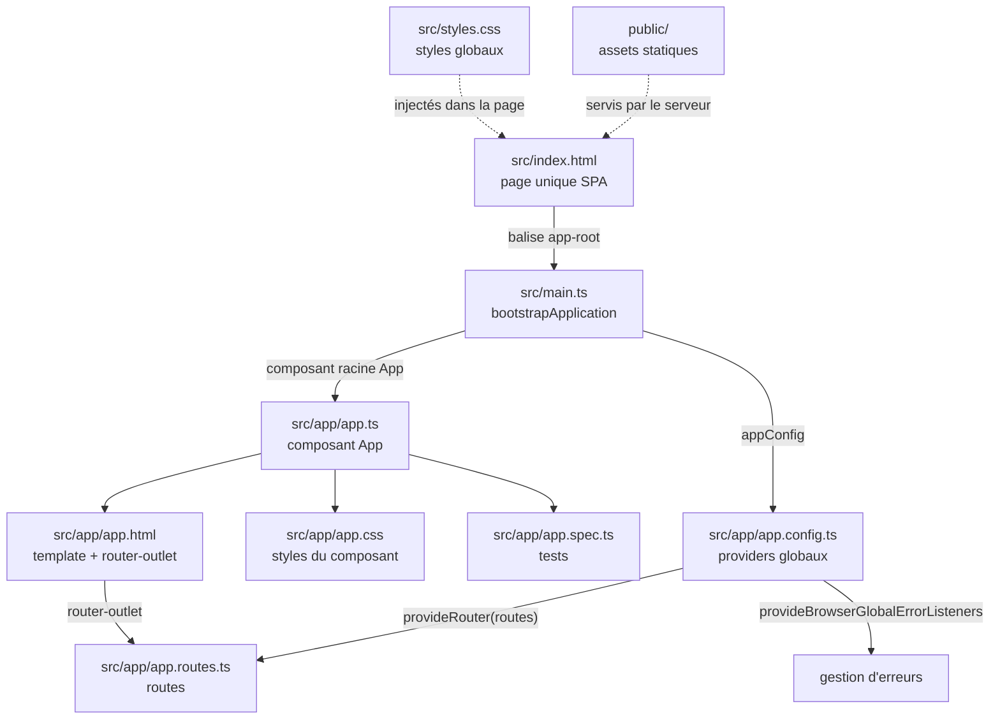

# TODO — Configuration du projet Angular

Le projet est créé avec **Vite** et géré avec **PNPM**.
On veut créer un projet angular (+tailwind + DaisyUI) qui sera notre hub de cours / entrainement sur ce framework
## 1. Création du projet

Comme tous les framework angular propose ses propres commande CLI pour créer des projet.
Mais comme on connait depuis JS et ou VUE / Nuxt, on peut créer des projet Angular via Vite (c'est ce qu'on va faire)

Dans un terminal : dans le système de fichier, se déplacer à un endroit (commande cd) ou l'on veut créer notre application
Lancer la commande :

```bash
pnpm create vite
```

Vite pose ensuite plusieurs questions de configuration. Répondre comme suit.

### a. Project Name

Nom du projet : `angular-antho`

### b. Select a Framework

Sélectionner **Angular**.

### c. Select a variant

Sélectionner **Angular**.

> **Pourquoi Angular et non Analog ?**
>
> Analog est un meta-framework basé sur Angular. Pour ce projet, on utilise Angular directement : Analog n’est pas nécessaire.

### d. Which stylesheet system would you like to use?

Sélectionner **Tailwind CSS**.

Documentation officielle : [tailwindcss.com](https://tailwindcss.com)

### e. Which AI tools should Angular integrate with?

Sélectionner **None**.

Aucun outil d’IA ne sera intégré automatiquement au projet pour le moment.

## 2. Installation des dépendances

Une fois le projet créé, se placer dans son dossier :

```bash
cd angular-antho
```

Puis installer les dépendances :

```bash
pnpm install
```

## 3. Lancer le serveur de développement

Démarrer le projet :

```bash
pnpm dev
```

L’application est alors disponible à l’adresse indiquée par Vite, en général :

[http://localhost:5173](http://localhost:5173)

## 4. Installation de DaisyUI

Documentation officielle : [daisyui.com/docs/install/angular](https://daisyui.com/docs/install/angular/)

Tailwind CSS a déjà été installé pendant le setup Vite : le fichier `.postcssrc.json` est donc déjà configuré. Il reste à ajouter **daisyUI**.

### Installation

```bash
pnpm add daisyui@latest
```

### Plugin CSS

Suivre le tutoriel DaisyUI : mettre à jour le CSS de base de l’application, `src/styles.css`, pour y ajouter le plugin DaisyUI :

```css
@import 'tailwindcss';
@plugin "daisyui";
```

## 5. Vérification

Dans `app.html` (template du composant racine `App`) :

1. Supprimer le contenu de la balise `<style></style>`.
2. Tester un composant DaisyUI pour vérifier l’installation et la configuration.
3. Création d'un dossier public/assets(pour ranger des images ou autres plus tard)

Exemple : des cartes avec un effet 3D — [3D hover effect for image gallery](https://daisyui.com/components/hover-3d/#3d-hover-effect-for-image-gallery).


### Tour du propriétaire

On va modifier `app.html` et parcourir la structure de base d’un projet Angular.

Dans `app.html` : **supprimer** (ou commenter) le style et le HTML de démo. On peut **garder** la balise `<router-outlet>` : elle est liée au routing et servira plus tard à afficher les composants associés aux routes (détails plus tard).

#### Fichiers de base du projet

- **`public/`** — images, favicon et autres assets servis tels quels par le serveur (ici le serveur de dev).
- **`src/`** — cœur de l’application Angular.

Angular construit une **SPA** (*Single Page Application*) : une seule page HTML, le reste est rendu par des composants.

| Fichier | Rôle |
| --- | --- |
| `src/index.html` | Unique page HTML. Contient la balise `<app-root>`, point d’ancrage du composant racine. |
| `src/main.ts` | Premier fichier TypeScript exécuté. Démarre l’app avec `bootstrapApplication(App, appConfig)`. |
| `src/styles.css` | Styles globaux de l’application (les composants peuvent aussi avoir leur propre CSS). |

#### Dossier `src/app/`

C’est ici que vivent les composants. Pour l’instant, le composant racine `App` est à la racine de `app/`. Plus tard, on pourra créer un sous-dossier par composant.

Un composant Angular est en général réparti en **4 fichiers** :

| Fichier | Rôle |
| --- | --- |
| `app.ts` | Logique TypeScript du composant. |
| `app.html` | Template HTML. |
| `app.css` | Styles propres au composant. |
| `app.spec.ts` | Tests unitaires. |

Fichiers de configuration à côté :

| Fichier | Rôle |
| --- | --- |
| `app.config.ts` | Config globale, importée dans `main.ts`. Exporte `appConfig` avec un tableau `providers` : `provideBrowserGlobalErrorListeners()` (gestion d’erreurs) et `provideRouter(routes)` (routing). |
| `app.routes.ts` | Définition des routes. Généré à la création du projet ; les composants y seront branchés plus tard. |

#### Schéma — démarrage de l’application



## 6. Analyse du système de composant

Dans Angular, un composant est en général réparti sur **trois fichiers** : `.ts`, `.html`, `.css`.

> Il existe aussi un fichier `.spec.ts` pour les tests. Pas besoin pour l’instant.

### Le fichier `.ts`

Il définit le composant comme une **classe exportable**.

Exemple avec `app.ts` (composant racine) :

1. On importe des API Angular (`Component`, `signal`, `RouterOutlet`, …).
2. On **exporte une classe** du même nom que le composant, avec sa logique.
3. La classe est enrichie par le décorateur TypeScript **`@Component`**.

Un décorateur (`@exemple`) ajoute des **métadonnées** à une classe. C’est ainsi qu’Angular reconnaît et configure chaque composant.

Dans `@Component`, on précise notamment :

| Option | Rôle |
| --- | --- |
| `imports` | Fonctionnalités Angular utilisées par ce composant. |
| `selector` | Balise HTML pour insérer le composant ailleurs (`<app-root>`). |
| `styleUrl` | Fichier CSS du composant. |
| `templateUrl` | Fichier HTML (template) du composant. |

```ts
import { Component, signal } from '@angular/core';
import { RouterOutlet } from '@angular/router';

@Component({
  imports: [RouterOutlet],
  selector: 'app-root',
  styleUrl: './app.css',
  templateUrl: './app.html',
})
export class App {
  protected readonly title = signal('angular-antho');
}
```

#### Single File Component (SFC)

Approche plus moderne : tout le composant vit dans le fichier `.ts` (template et styles inclus).

À la place de `styleUrl`, on passe le CSS dans un tableau de chaînes (`styles`) :

```ts
styles: [
  `
    p {
      color: red;
    }
  `,
],
```

À la place de `templateUrl`, on passe le HTML dans `template` :

```ts
template: `<p>Hello World</p>`,
```

Exemple complet en SFC :

```ts
import { Component, signal } from '@angular/core';

@Component({
  selector: 'app-hello-card',
  styles: [
    `
      p {
        color: red;
      }
    `,
  ],
  template: `<p>Hello World</p>`,
})
export class HelloCard {
  protected readonly title = signal('Exemple');
}
```

## 7. Création de composants

On ne crée pas les composants à la main. Angular propose des commandes CLI pour générer un composant et ses **4 fichiers de base**.

> **Convention de nommage** : un composant est une classe TypeScript. On le nomme en **PascalCase** (ex. `FakeComp`).

### Commande

```bash
ng generate component FakeComp
```

Raccourci :

```bash
ng g component FakeComp
```

Angular crée automatiquement le dossier et les fichiers du composant.


#### Fichiers générés

Le fichier TypeScript est déjà préconfiguré. Plus tard, on importera des API Angular et on écrira la logique dans la classe `FakeComp`.

```ts
import { Component } from '@angular/core';

@Component({
  imports: [],
  selector: 'app-fake-comp',
  styleUrl: './fake-comp.css',
  templateUrl: './fake-comp.html',
})
export class FakeComp {}
```

Template HTML de départ :

```html
<p>fake-comp works!</p>
```

#### Sous-dossier

On peut indiquer un sous-dossier directement dans la commande (`ng g c` = raccourci de `ng generate component`) :

```bash
ng g c dossierTest/TestComposant
```

`ng generate` permet aussi de créer des **classes**, des **fichiers d’environnement**, des **services**, etc. On s’en resservira plus tard.

Documentation : [angular.dev/cli/generate](https://angular.dev/cli/generate)

## 8. Création des composants de base

### 1. Création des composants de layout (Header et Footer)
Pour une meilleure organisation, nous allons créer deux composants dédiés au **Header** et au **Footer** de l'application dans un dossier `layouts`.

```bash
ng g c layout/Header
ng g c layout/Footer
```

### 2. Modification des templates des composants
Une fois les composants créés, nous allons modifier leurs templates respectifs pour intégrer une navbar dans le `Header` et un footer dans le `Footer`.

> **Astuce :** Vous pouvez utiliser les composants [DaisyUI](https://daisyui.com/) ou des outils d'IA pour générer rapidement des templates accessibles et responsive.

### 3. Importation et utilisation des composants
Une fois nos composants `Header` et `Footer` créés et stylisés, nous allons les importer et les utiliser dans le composant racine `App`.

#### Configuration de `app.ts`
Pour que le composant `App` puisse utiliser ces nouveaux composants, il faut les importer (via leur nom de classe) et les ajouter au tableau `imports` du décorateur `@Component`.

```typescript
import { Component, signal } from '@angular/core';
import { RouterOutlet } from '@angular/router';
import { Header } from './layout/header/header';
import { Footer } from './layout/footer/footer';

@Component({
  selector: 'app-root',
  imports: [RouterOutlet, Header, Footer],
  styleUrl: './app.css',
  templateUrl: './app.html',
})
export class App {
  protected readonly title = signal('angular-antho');
}
```

#### Utilisation dans `app.html`
Maintenant que le composant `App` connaît le `Header` et le `Footer`, nous allons utiliser leurs sélecteurs dans `app.html` pour entourer la balise `<router-outlet />` (qui permet le rendu des futurs composants de pages).

```html
<div class="flex flex-col min-h-screen">
  <app-header></app-header>

  <main class="grow">
    <router-outlet />
  </main>

  <app-footer></app-footer>
</div>
```


## 9. Créer des composants pour des pages

Maintenant que l'on a une structure d'application de base, on va créer des composants qui correspondront à des pages classiques que l'on retrouve dans la plupart des sites web. Ces composants seront ensuite affichés dans la balise `<router-outlet />` située dans le composant `App`.

Pour garder une certaine organisation, on va créer les composants dans un dossier `pages` sous `src/app`.

```bash
ng g c pages/Home
ng g c pages/About
ng g c pages/Contact
ng g c pages/NotFound
```

On peut ensuite créer des templates pour ces pages avec DaisyUI et/ou de l'IA.

### 1. Ajouter les routes

Ensuite, on va définir une route pour chaque composant dans `app.routes.ts`.

Une route correspond à un objet dans le tableau `routes`, avec au minimum 2 propriétés :

- `path` : le nom de la route / l'URL
- `loadComponent` : le composant à charger dans `<router-outlet />`

Exemple de route vers une page About :

```ts
export const routes: Routes = [
  {
    path: 'about',
    loadComponent: () => import('./pages/about/about').then(m => m.AboutComponent),
  },
];
```

### 2. Créer les autres routes

On va ensuite ajouter les routes pour :

- `home`
- `about`
- `contact`
- une route par défaut
- une route spéciale pour les URL inconnues

### 3. Route par défaut et route 404

On configure d'abord une route vide qui redirige vers `home`, puis une route wildcard pour les URLs invalides.

`app.routes.ts`

```ts
import { Routes } from '@angular/router';

export const routes: Routes = [
  {
    path: '',
    redirectTo: 'home',
    pathMatch: 'full',
  },
  {
    path: 'home',
    loadComponent: () => import('./pages/home/home').then(m => m.Home),
  },
  {
    path: 'about',
    loadComponent: () => import('./pages/about/about').then(m => m.About),
  },
  {
    path: 'contact',
    loadComponent: () => import('./pages/contact/contact').then(m => m.Contact),
  },
  {
    path: '**',
    loadComponent: () => import('./pages/not-found/not-found').then(m => m.NotFound),
  },
];
```

> On peut tester les routes directement dans le navigateur, par exemple : `http://localhost:4200/contact`

### 4. Ajouter des liens dans le Header

Ensuite, on met à jour le composant `Header` pour ajouter des liens vers les routes créées.

Dans `header.ts`, on ajoute `RouterLink` et on le place dans le tableau `imports` :

```ts
import { Component } from '@angular/core';
import { RouterLink } from '@angular/router';

@Component({
  imports: [RouterLink],
  selector: 'app-header',
  styleUrl: './header.css',
  templateUrl: './header.html',
})
export class Header {}
```

Dans le template, on peut alors créer des liens comme ceci :

```html
<a routerLink="/home">Accueil</a>
```

### Captures d'écran

- Page home : 
- Page contact : 
- Page about : 
- Page 404 : 

On a vu les bases de la création de composants et du système de routing.


## 10. Création de composants pour s'entraîner au text interpolation

Nous allons enrichir notre hub de cours avec deux types de pages :

- les **leçons**, dans `src/app/pages/lessons/` ;
- les **exercices**, dans `src/app/pages/exercices/`.

Pour commencer, créons un composant pour la leçon et un autre pour l'exercice
consacrés au *text interpolation*. Pour le moment, nous conserverons les
templates générés par Angular et nous les compléterons dans une prochaine étape.

### 1. Créer le composant de leçon

Depuis la racine du projet, exécutons la commande suivante :

```bash
ng generate component pages/lessons/TextInterpolationLesson
```

Version abrégée :

```bash
ng g c pages/lessons/TextInterpolationLesson
```

Angular crée le composant dans le dossier
`src/app/pages/lessons/text-interpolation-lesson/`.

### 2. Créer le composant d'exercice

Créons ensuite le composant correspondant à l'exercice :

```bash
ng generate component pages/exercices/TextInterpolationExercice
```

Le composant est créé dans le dossier
`src/app/pages/exercices/text-interpolation-exercice/`.

### Résultat attendu

Nous disposons maintenant de deux composants indépendants :

| Composant | Rôle |
| --- | --- |
| `TextInterpolationLesson` | Présenter le cours sur l'interpolation de texte |
| `TextInterpolationExercice` | Permettre de s'entraîner avec l'interpolation de texte |

Les routes de ces composants seront ajoutées dans la prochaine section afin de
les rendre accessibles depuis le navigateur.


## 11. Optimisation des routes

À terme, notre hub de cours comportera de nombreuses routes : plus d'une dizaine
pour les leçons et autant pour les exercices. Toutes les déclarer dans
`app.routes.ts` rendrait rapidement le fichier difficile à maintenir.

Angular permet de regrouper les routes liées à une même fonctionnalité dans des
fichiers dédiés. Ces groupes sont ensuite chargés à la demande grâce à
`loadChildren`.

### Objectif

Nous allons organiser les routes de cette manière :

| Fonctionnalité | Fichier de routes | Préfixe d'URL |
| --- | --- | --- |
| Leçons | `pages/lessons/lessons.routes.ts` | `/lessons` |
| Exercices | `pages/exercices/exercices.routes.ts` | `/exercices` |
| Évaluations | `pages/evaluations/evaluations.routes.ts` | `/evaluations` |

Chaque fichier contiendra les routes enfants de sa fonctionnalité. Par exemple,
la route de la leçon sur l'interpolation sera accessible à l'adresse suivante :

`http://localhost:4200/lessons/text-interpolation`

### 1. Créer le groupe de routes des leçons

Dans `src/app/pages/lessons/lessons.routes.ts`, ajoutons une constante typée
avec `Route[]` :

```ts
import { Route } from '@angular/router';

export const LESSONS_ROUTES: Route[] = [
  {
    path: 'text-interpolation',
    loadComponent: () =>
      import('./text-interpolation-lesson/text-interpolation-lesson')
        .then(m => m.TextInterpolationLesson),
  },
];
```

`LESSONS_ROUTES` est donc un tableau de routes Angular. D'autres leçons pourront
être ajoutées dans ce même tableau sans alourdir le fichier global.

### 2. Charger les groupes depuis `app.routes.ts`

Dans le fichier global `src/app/app.routes.ts`, ajoutons une route par groupe :

```ts
{
  path: 'lessons',
  loadChildren: () =>
    import('./pages/lessons/lessons.routes')
      .then(m => m.LESSONS_ROUTES),
},
```

La valeur de `path` (`lessons`) est automatiquement combinée avec le chemin de
la route enfant (`text-interpolation`). Le résultat est donc
`/lessons/text-interpolation`.

### 3. Centraliser les autres routes

Appliquons le même principe aux exercices et aux évaluations :

- `exercices.routes.ts` exporte `EXERCICES_ROUTES` ;
- `evaluations.routes.ts` exporte `EVALUATIONS_ROUTES`.

Dans chaque fichier, les routes utilisent uniquement un chemin relatif au groupe
concerné. Par exemple, une route `path: 'attributes-binding'` dans
`EXERCICES_ROUTES` sera accessible via `/exercices/attributes-binding`.

### 4. Configuration finale

Le fichier `app.routes.ts` conserve les routes générales et délègue les groupes
spécialisés à leurs fichiers respectifs :

```ts
import { Routes } from '@angular/router';

export const routes: Routes = [
  {
    path: '',
    redirectTo: 'home',
    pathMatch: 'full',
  },
  {
    path: 'home',
    loadComponent: () => import('./pages/home/home').then(m => m.Home),
  },
  {
    path: 'about',
    loadComponent: () => import('./pages/about/about').then(m => m.About),
  },
  {
    path: 'contact',
    loadComponent: () => import('./pages/contact/contact').then(m => m.Contact),
  },
  {
    path: 'lessons',
    loadChildren: () =>
      import('./pages/lessons/lessons.routes')
        .then(m => m.LESSONS_ROUTES),
  },
  {
    path: 'exercices',
    loadChildren: () =>
      import('./pages/exercices/exercices.routes')
        .then(m => m.EXERCICES_ROUTES),
  },
  {
    path: 'evaluations',
    loadChildren: () =>
      import('./pages/evaluations/evaluations.routes')
        .then(m => m.EVALUATIONS_ROUTES),
  },
  {
    path: '**',
    loadComponent: () =>
      import('./pages/not-found/not-found').then(m => m.NotFound),
  },
];
```

> **À retenir :** `loadChildren` charge un groupe de routes à la demande,
> tandis que `loadComponent` charge un composant précis. Cette organisation
> améliore la lisibilité du projet et prépare son évolution.

// ... existing code ...
## 12. Exercice Text Interpolation {{ }}

L'interpolation permet d'afficher des valeurs de propriétés de classe directement dans le template.

### 📘 Exemple de référence

En s'inspirant de cet exemple de la documentation d'Angular :

```ts
@Component({
  template: `
    <p>Your color preference is {{ theme }}.</p>
  `,
  ...
})
export class App {
  theme = 'dark';
}
```

### La mission

Dans le composant `src/pages/exercices/text-interpolation-exercice`, réalisez les tâches suivantes :

1. **Déclarer des variables** : Dans le fichier `.ts`, créez des propriétés de différents types :
    - `string` (chaîne de caractères)
    - `number` (nombre)
    - `boolean` (booléen)
    - `Array` (tableau)
    - `Object` (objet)
2. **Afficher les variables** : Dans le template HTML, utilisez la syntaxe `{{ variable }}` pour afficher chaque donnée.

> **💡 Conseil** : Essayez de mélanger du texte statique et des variables, par exemple : `Le nom est {{ name }}`.

### Résultat attendu


## 13. Exercice : Attribute Binding

L'**Attribute Binding** (liaison d'attribut) permet de lier une propriété d'un élément HTML à une valeur définie dans votre composant TypeScript. 

### 💡 Concept
Pour lier un attribut HTML (comme `src`, `href`, `disabled`, etc.) à une propriété du composant, on utilise la syntaxe suivante :
`[attribut]="expression_ts"`

**Exemple type :**
```ts
 
<!-- Ici, l'attribut 'src' de l'image est lié à la propriété 'productImage' du TS -->
```

#### Exemple complet
Voici un exemple d'un composant affichant un produit :

```ts
import { Component } from '@angular/core';

@Component({
  selector: 'app-product',
  standalone: true,
  template: `
    <div class="product">
      <h2>{{ productName }}</h2> <!-- Interpolation -->
       <!-- Property binding -->
    </div>
  `
})
export class ProductComponent {
  productName = 'Produit 1';
  productImage = 'assets/product1.jpg';
}
```

---

## 14. Exercice : Profil Utilisateur

**Objectif :** Créer un composant capable d'afficher dynamiquement les informations d'un utilisateur en utilisant le binding d'attributs.

#### Consignes

1. **Création du composant** : 
   Créez un nouveau composant nommé `attribute-binding-exercice` (vous pouvez également configurer une route pour y accéder).

2. **Préparation des données (TypeScript)** :
   Dans votre fichier `.ts`, créez un objet `user` contenant les propriétés suivantes :
   * `id` (number)
   * `name` (string)
   * `age` (number)
   * `image` (string : URL d'une image ou chemin local)
   * `bio` (string)
   * `status` (string : `'online'` ou `'offline'`)
   * `github` (string : URL d'un profil GitHub)

Bonus : (Typer l'objet avec une interface TS)

3. **Développement du template (HTML)** :
   Affichez les informations de l'utilisateur en respectant ces règles :
   * **Interpolation** : Utilisez `{{ }}` pour afficher le nom, l'âge et la bio.
   * **Attribute Binding** : Utilisez la syntaxe `[src]` pour lier l'image de l'utilisateur.
   * **Logique (Ternaire)** : Affichez une mention de **réputation** en fonction du `status` de l'utilisateur en utilisant une expression ternaire :
     * Si `status === 'online'` $\rightarrow$ afficher **"Cool "**
     * Si `status === 'offline'` $\rightarrow$ afficher **"Ringard "**

#### Résultat attendu


## 15. Event Binding (Liaison d'Événements)

L'**Event Binding** est un mécanisme qui permet à votre application de réagir aux actions de l'utilisateur (clics, saisie au clavier, mouvements de souris, soumission de formulaire, etc.). 

Contrairement au *Property Binding* (qui va de le composant vers la vue), l'**Event Binding** va de la vue vers le composant.

#### 🚀 Mise en place
Pour pratiquer cet exemple, générez un nouveau composant dédié :

```bash
ng g c pages/lessons/EventBindingLesson
```

*N'oubliez pas d'ajouter la nouvelle route dans votre fichier `lessons.routes.ts` pour y accéder.*

---

### Le Concept

La syntaxe utilise des **parenthèses** autour de l'événement cible :

` (événement)="méthode($event)" `

* **`événement`** : Le nom de l'action (ex: `click`, `input`, `submit`, `mouseover`).
* **`$event`** : Un objet spécial qui contient les détails de l'événement (quelle touche a été pressée, la valeur de l'input, la position de la souris, etc.).

---

### Implémentation

#### 1. Le Composant (TypeScript)
Dans le fichier `.ts`, nous définissons les variables pour stocker l'état et les méthodes pour traiter les événements.

```ts
import { Component } from '@angular/core';

@Component({
  selector: 'app-event-binding-lesson',
  standalone: true,
  styleUrl: './event-binding-lesson.css',
  templateUrl: './event-binding-lesson.html',
})
export class EventBindingLesson {
  // État de notre composant
  username: string = '';
  clickCount: number = 0;

  /**
   * Réagit à l'événement de saisie (input)
   * @param event Contient les détails de l'événement HTML
   */
  onInputChange(event: Event) {
    // On récupère la cible de l'événement et on le "cast" en HTMLInputElement
    // pour accéder à sa propriété .value en toute sécurité
    const input = event.target as HTMLInputElement;
    this.username = input.value;
    
    console.log('Nouvelle valeur :', this.username);
  }

  /**
   * Réagit au clic sur un bouton
   */
  onButtonClick() {
    this.clickCount++;
  }
}
```

#### 2. Le Template (HTML)
Dans le fichier `.html`, nous lions les éléments HTML à nos fonctions.

```html
<div class="event-binding-container">
  
  <!-- ⌨️ Exemple d'input : on passe $event pour récupérer la valeur saisie -->
  <div class="control-group">
    <label for="name-input">Saisissez votre nom :</label>
    <input 
      id="name-input"
      type="text" 
      (input)="onInputChange($event)" 
      placeholder="Ex: Jean Dupont"
    />
  </div>

  <!-- Affichage dynamique via Interpolation -->
  <p class="greeting">
    Bonjour <span class="highlight">{{ username || '...' }}</span> !
  </p>

  <hr />

  <!-- 🖱️ Exemple de clic : pas besoin de passer $event si on ne l'utilise pas -->
  <div class="control-group">
    <button (click)="onButtonClick()">Cliquez-moi !</button>
    <p>Nombre de clics : <span class="count">{{ clickCount }}</span></p>
  </div>

</div>
```

---

### Points clés à retenir

1.  **La syntaxe des parenthèses** `(event)` est le déclencheur pour Angular. Il doit écouter un événement provenant du DOM.
2.  **L'objet `$event`** est crucial lorsque vous avez besoin de lire des propriétés spécifiques de l'élément qui a déclenché l'action (comme la valeur d'un champ texte).
3.  **Type Safety (TypeScript)** : En utilisant `event.target as HTMLInputElement`, vous permettez à TypeScript de comprendre que vous manipulez un champ de saisie, ce qui évite des erreurs lors de l'accès à `.value`.

## 16. Exercice : Event Binding & Gestion du timing

**Objectif :** Maîtriser l'utilisation des événements clavier (`keyup`) et de clic (`click`), tout en s'initiant à la gestion de l'asynchronisme via le constructeur du composant.

---

#### Préparation

1. **Générer le composant** :
   ```bash
   ng g c pages/exercices/EventBindingExercice
   ```

2. **Configuration des routes** :
   Déclarez la nouvelle route pour ce composant dans votre fichier `exercices.routes.ts`.

---

#### Objectifs de l'exercice

#### 1. Réactivité à la saisie (Input)
Créez un champ de saisie (`<input>`) qui écoute l'événement `(keyup)`. À chaque fois que l'utilisateur relâche une touche, la valeur saisie doit s'afficher en temps réel dans une balise `<p>` située juste en dessous.

#### 2. Gestion de statut (Bouton)
Définissez une variable `listFriendsCreationStatus` (de type `string`) initialisée à `"aucun ami"`. 
Ajoutez un bouton dans votre template. Au clic sur ce bouton, le message doit passer à : `"🥳 Votre ami a été ajouté !"`.

#### 3. Défi Timer
*Introduction au Cycle de vie* : Dans le `constructor` du composant, implémentez un `setTimeout`. 
**Contrainte** : Au bout de **5 secondes** après le chargement du composant, le bouton de création (créé à l'étape 2) doit devenir **inactif** (`disabled`).

---

#### Aide au développement

**Structure suggérée du composant (TypeScript) :**

```ts
import { Component } from '@angular/core';

@Component({
  imports: [],
  selector: 'app-event-binding-exercice',
  styleUrl: './event-binding-exercice.css',
  templateUrl: './event-binding-exercice.html',
})
export class EventBindingExercice {
  constructor() {
    console.log('Début de vie du composant (moment ou angular instancie le composant)');
    //Logique du setimeout
  }
  //Logique du composant (les données et méthodes)
}
```

---

#### Résultat attendu

1. **État initial** (au chargement) :
   * L'input est vide.
   * Le statut affiche "aucun ami".
   * Le bouton est actif.


2. **Après interaction** (après saisie et clic) :
   * Le texte de l'input est répercuté dans le `<p>`.
   * Le statut affiche "🥳 Votre ami a été ajouté !".
   * **Après 5 secondes**, le bouton est grisé (désactivé).


## 17. Two-Way Binding (Liaison Bidirectionnelle)

Jusqu'à présent, nous avons vu :
* **Property Binding** `[attribut]` : la donnée va du composant vers la vue (Unidirectionnel).
* **Event Binding** `(événement)` : l'action va de la vue vers le composant (Unidirectionnel).

Le **Two-Way Binding** (liaison bidirectionnelle) fusionne ces deux concepts. Cela permet de lier une donnée de votre composant à un champ de formulaire de manière à ce que :
1. Toute modification dans le composant mette à jour l'input.
2. Toute saisie de l'utilisateur dans l'input mette à jour la variable dans le composant.

---

### Prérequis : Le module `FormsModule`

La directive `ngModel` n'est pas incluse par défaut dans le cœur d'Angular. Pour l'utiliser, vous **devez absolument** importer le module `FormsModule` dans votre composant (si c'est un composant `standalone`) ou dans votre `AppModule`.

---

### 💡 Syntaxe : "The Banana in a Box"

La syntaxe du Two-Way Binding peut paraître étrange au début : `[(ngModel)]`. 
Une astuce mnémotechnique pour s'en souvenir est de voir les parenthèses comme une **banane** et les crochets comme une **boîte** : `[ ( ) ]`.

* `[]` représente la direction **Donnée $\rightarrow$ Vue** (Property Binding).
* `()` représente la direction **Vue $\rightarrow$ Donnée** (Event Binding).
* `[()]` combine les deux !

---

### 💻 Implémentation

#### 1. Le Composant (TypeScript)
Dans le fichier `.ts`, nous importons `FormsModule` et définissons nos variables.

```ts
import { Component } from '@angular/core';
import { FormsModule } from '@angular/forms'; // 👈 Très important !

@Component({
  selector: 'app-two-way-binding-lesson',
  standalone: true,
  imports: [FormsModule], // 👈 On l'ajoute ici
  templateUrl: './two-way-binding-lesson.html',
  styleUrl: './two-way-binding-lesson.css'
})
export class TwoWayBindingLesson {
  username: string = 'Jean Dupont'; // Pré-rempli
  usermail: string = '';
}
```

#### 2. Le Template (HTML)
Dans le fichier `.html`, on applique la directive `[(ngModel)]` sur nos champs de saisie.

```html
<div class="container">
  <h2>Profil Utilisateur</h2>

  <!--  Liaison bidirectionnelle sur le nom -->
  <div class="form-group">
    <label for="name">Nom :</label>
    <input 
      id="name"
      type="text" 
      [(ngModel)]="username" 
      placeholder="Entrez votre nom"
    />
  </div>

  <!--  Liaison bidirectionnelle sur l'email -->
  <div class="form-group">
    <label for="email">Email :</label>
    <input 
      id="email"
      type="email" 
      [(ngModel)]="usermail" 
      placeholder="Entrez votre mail"
    />
  </div>

  <hr>

  <!-- Visualisation en temps réel -->
  <div class="preview">
    <h3>Aperçu en direct :</h3>
    <p><strong>Nom :</strong> {{ username }}</p>
    <p><strong>Email :</strong> {{ usermail }}</p>
  </div>
</div>
```

---

### Ce qui se passe concrètement :

| Action | Direction | Résultat |
| :--- | :---: | :--- |
| **Au chargement** | `TS --> Template` | L'input affiche "Jean Dupont" (valeur initiale de `username`). |
| **L'utilisateur tape "Alice"** | `Template --> TS` | La variable `username` devient automatiquement `"Alice"`. |
| **Le code fait `this.username = 'Bob'`** | `TS --> Template` | Le texte dans l'input change instantanément pour devenir "Bob". |

## 18. Exercice : Two-Way Binding & Édition en Temps Réel

**Objectif :** Créer une interface interactive où les modifications effectuées dans un formulaire de saisie mettent à jour instantanément un profil utilisateur affiché sous forme de "Card".

---

#### Préparation

1. **Générer le composant** :
   ```bash
   ng g c pages/exercices/TwoWayBindingExercice 
   ```

2. **Configuration des routes** :
   Déclarez la nouvelle route pour ce composant dans votre fichier `exercices.routes.ts`.

3. **Importation indispensable** :
   N'oubliez pas d'importer `FormsModule` dans votre composant pour pouvoir utiliser `ngModel`.

---

#### Missions

Cet exercice est une évolution de l'exercice précédent sur le profil utilisateur. Vous allez passer d'une simple lecture de données à un système d'édition dynamique.

#### 1. La "User Card" (Affichage)
Affichez les informations d'un utilisateur (Nom, Email, Bio, etc.) dans un composant stylisé (une "Card"). Ces informations proviennent des variables définies dans votre classe TypeScript.

#### 2. Le Formulaire d'Édition (Liaison Bidirectionnelle)
Ajoutez, en dessous de votre Card, un formulaire de modification. Pour chaque champ (Nom, Email, Bio) :
* Utilisez des directives `[(ngModel)]` pour lier les input directement à leur propriété correspondante de votre objet utilisateur.
* **Résultat attendu** : Dès que vous tapez une lettre dans le formulaire, la "User Card" doit se mettre à jour en temps réel sans aucun bouton "Valider".

#### 3. Fonctionnalité de Réinitialisation (Reset)
Ajoutez un bouton **"Réinitialiser le profil"** au sein du formulaire.
* Au clic sur ce bouton, vous devez remettre les données de l'utilisateur à leurs valeurs initiales (ex: revenir au nom "Jean Dupont").
* Grâce au Two-Way Binding, les champs du formulaire et la Card doivent se remettre à zéro simultanément.

---
#### Résultat attendu

1. **État initial** : La Card affiche les informations par défaut. Le formulaire est pré-rempli avec ces mêmes informations.


2. **Mode Édition** : En modifiant des champs, la Card change instantanément pour refléter la nouvelle saisie.


3. **Après Reset** : En cliquant sur le bouton, les données de la Card et les champs du formulaire reviennent à leur état d'origine.

## 19. Le Concept des Signals

Angular est un framework en constante évolution, caractérisé par un rythme de mise à jour soutenu (une nouvelle version majeure tous les 6 mois environ). 

Depuis la **version 16**, Angular a introduit une nouvelle approche pour gérer la réactivité. Bien que les Signals aient d'abord été intégrés progressivement à l'écosystème, l'équipe Angular accentue leur utilisation pour en faire le pilier de la réactivité moderne, notamment à partir de la **version 22**.

### À quoi servent les Signals ?

L'adoption des Signals apporte trois améliorations majeures au framework :

* **⚡ Performance chirurgicale**  
  Contrairement au système historique basé sur `Zone.js` — qui doit vérifier l'intégralité de l'arbre des composants à chaque changement détecté — les **Signals** permettent une mise à jour **ciblée**. Seuls les parties du template ou les composants réellement impactés par la modification sont mis à jour.

* **🛠️ Simplification du code**  
  Les Signals simplifient la gestion d'états simples, là où `RxJS` pourrait s'avérer trop complexe. L'un des avantages majeurs est la disparition de la gestion manuelle des désabonnements (`unsubscribe`), ce qui élimine considérablement le risque de **fuites de mémoire**.

* **📖 Lecture intuitive**  
  La syntaxe est propre, lisible et prévisible. Pour lire la valeur d'un signal, il suffit de l'appeler comme une fonction (ex: `maVariable()`), et Angular s'occupe de la mise à jour automatique du template de manière transparente.


## 20. Exercice : Panier d'achat réactif (Signals)

**Sujet :** « Le Panier d'Achat »  
**Objectif :** Créer un composant de gestion d'article utilisant les **Signals** pour assurer une réactivité fluide et performante.

### Objectifs techniques
- [ ] **Gestion de l'état :** Déclarer un `signal` pour stocker la quantité (`quantity`).
- [ ] **Valeur calculée :** Utiliser `computed` pour calculer automatiquement le prix total (`totalPrice = quantity * unitPrice`).
- [ ] **Effets secondaires :** Utiliser `effect` pour synchroniser la quantité avec le `localStorage` ou afficher un log dans la console à chaque modification.

### Interface & Règles métier
L'interface utilisateur doit permettre de manipuler la quantité via trois contrôles :

1.  **Bouton `+1`** : Augmente la quantité de 1.
2.  **Bouton `-1`** : Diminue la quantité de 1. 
    *   ⚠️ **Contrainte :** La quantité ne doit jamais être inférieure à `0`.
3.  **Bouton `Réinitialiser`** : Remet la quantité à zéro.


